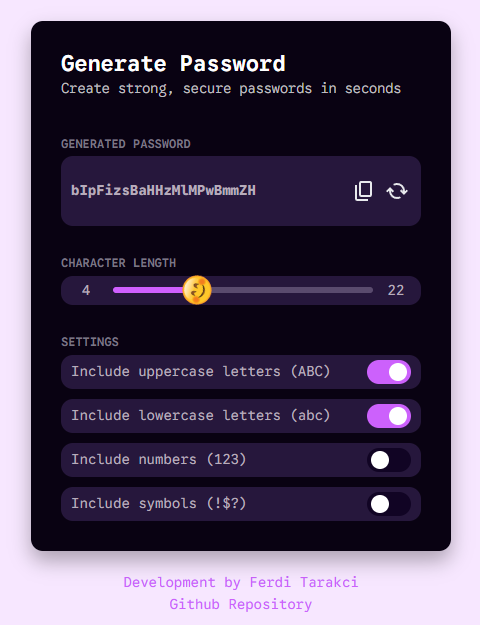

# React Password Generator

## Application Description

This app is built using Vite & React & Typescript. The app is used to generate a secure, random password.

## Uygulama Tanımı (TR)

Bu uygulama Vite, React ve Typescript kullanılarak oluşturulmuştur. Uygulama, güvenli ve rastgele bir parola oluşturmak için kullanılır.

## Deployment

This project is automatically imported into the production environment with Vercel.

TR: Bu proje Vercel ile otomatik olarak üretim ortamına aktarılır.
<br><br>

https://password-generator.ferditarakci.com.tr

<br>

## UI quote

https://app.bigdevsoon.me/challenges/password-generator/browser

## Project setup

```
yarn
```

### Compiles and hot-reloads for development

```
yarn dev
```

### Compiles and minifies for production

```
yarn build
```

This template provides a minimal setup to get React working in Vite with HMR and some ESLint rules.

Currently, two official plugins are available:

- [@vitejs/plugin-react](https://github.com/vitejs/vite-plugin-react/blob/main/packages/plugin-react) uses [Babel](https://babeljs.io/) for Fast Refresh
- [@vitejs/plugin-react-swc](https://github.com/vitejs/vite-plugin-react/blob/main/packages/plugin-react-swc) uses [SWC](https://swc.rs/) for Fast Refresh

## Expanding the ESLint configuration

If you are developing a production application, we recommend using TypeScript with type-aware lint rules enabled. Check out the [TS template](https://github.com/vitejs/vite/tree/main/packages/create-vite/template-react-ts) for information on how to integrate TypeScript and [`typescript-eslint`](https://typescript-eslint.io) in your project.

## Screenshot

<br>
